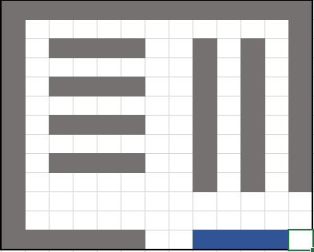

# PAPO_SS2017
Parallele Programmierung Praktikum SS2017 \\
Zu grundlegenden Verständniss von Message Passing,
wird ein simples Programm erstellt.

# Supermarkt

Markt besteht aus Gang(Weiß) oder Schrankt(Grau).
Kunden werden nun der Reihe nach im Eingang(Blau)
mit einer Einkaufsliste erstellt und müssen sich 
ihren Weg durch den Laden suchen.

Hinzukommen Mitarbeiter welche Waren nachfüllen,
wenn diese ausgegangen sind.

